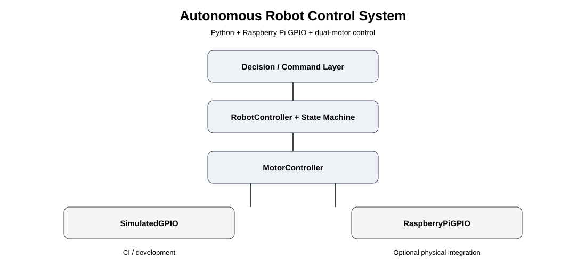

# Autonomous Robot Control System


Python-based real-time robot control software using Raspberry Pi GPIO, a five-state control model, PWM, and dual-motor control.

## Project Overview

The controller converts high-level operating states into deterministic motor direction and PWM commands.

### Five operating states

1. **IDLE** - motors stopped
2. **FORWARD** - both motors drive forward
3. **REVERSE** - both motors drive in reverse
4. **TURN_LEFT** - differential motor action for a left turn
5. **TURN_RIGHT** - differential motor action for a right turn

## Architecture



The design separates control logic from GPIO hardware access. A simulated GPIO backend supports development and CI, while an optional Raspberry Pi GPIO adapter provides the hardware integration layer.

## Repository Structure

```text
src/
├── control/
│   ├── state_machine.py
│   └── robot_controller.py
├── gpio/
│   └── gpio_interface.py
└── motors/
    └── motor_controller.py

tests/
├── test_state_machine.py
├── test_motor_control.py
└── test_integration.py

examples/
└── run_robot_controller.py

docs/
├── operating_states.md
├── system_architecture.md
└── system_architecture.svg

.github/workflows/
└── tests.yml
```

## Key Design Points

- Deterministic five-state control model.
- Separation between high-level control and low-level motor control.
- GPIO abstraction for simulation and Raspberry Pi integration.
- PWM duty-cycle validation from 0 to 100 percent.
- Automated tests for state transitions, motor direction, PWM behavior, and integration.
- Safe startup behavior places the robot in **IDLE**.

## Run Tests

```bash
python -m venv .venv
source .venv/bin/activate
pip install -r requirements.txt
pytest -q
```

## Run the Example

The example uses `SimulatedGPIO`, so it does not require a Raspberry Pi or connected motors.

```bash
python examples/run_robot_controller.py
```

## Raspberry Pi Hardware Integration

The repository includes a `RaspberryPiGPIO` adapter around `RPi.GPIO`.

Before physical operation:

1. Install a Raspberry Pi-compatible `RPi.GPIO` package.
2. Set `MotorPins` to match the actual motor-driver wiring.
3. Verify the motor driver and power supply.
4. Test with the robot lifted from the ground.
5. Document the actual pin mapping and hardware test results.

The pin numbers in the example are for the simulated backend and are **not** a verified physical wiring diagram.

## Testing and CI

GitHub Actions runs the Python test suite on pushes and pull requests to `main`.

The repository is intentionally structured so the core control logic can be tested without physical robot hardware.

## Hardware Validation Note

This repository is a hardware-ready reference implementation with a deterministic simulated GPIO backend. Physical Raspberry Pi and motor validation should only be documented after those tests have actually been performed.

## Skills Demonstrated

**Python | Raspberry Pi | GPIO | Motor Control | State Machines | PWM | Robotics Software Testing | GitHub Actions**

## Author

**Syed Sohel Khadri**

GitHub: https://github.com/sohailkhadri4-design  
LinkedIn: https://www.linkedin.com/in/syed-sohel-khadri-7b570b381/

## License

MIT License
